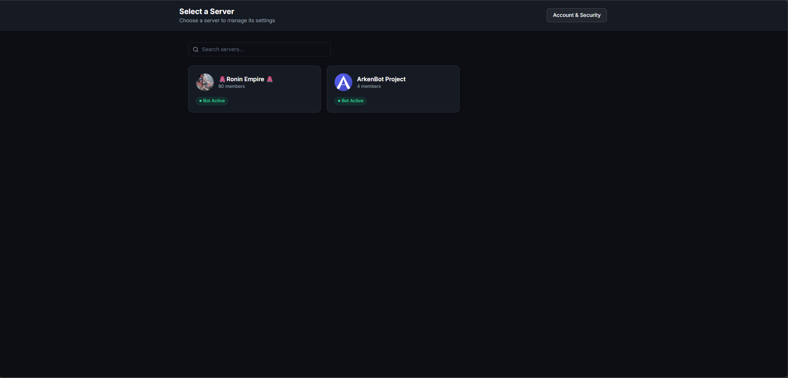
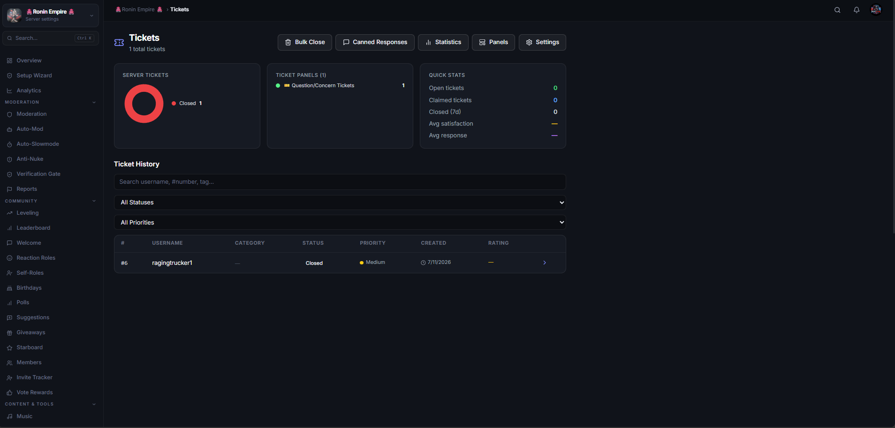
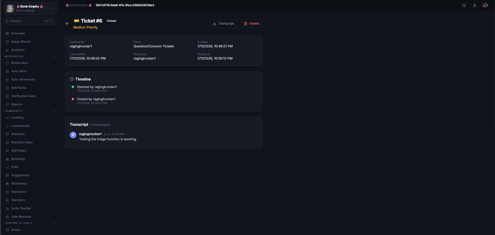
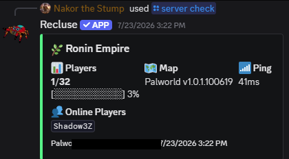

<div align="center">

# ArkenBot

### The Discord bot that does everything, elegantly.

Replace a stack of single-purpose bots with one **permanently free**, self-hostable solution — moderation, leveling, tickets, giveaways, music, live alerts, and full game-server management — all configured from a **real-time web dashboard**.

[](LICENSE.txt)
[](https://www.typescriptlang.org/)
[](https://discord.js.org/)
[](https://nextjs.org/)
[](https://nodejs.org/)

**[🌐 Website](https://arkenbot.app)** · **[📖 Docs](https://docs.arkenbot.app)** · **[➕ Add to Discord](https://discord.com/oauth2/authorize?client_id=1477178407543373834&permissions=8824675416665207&integration_type=0&scope=bot+applications.commands)** · **[💬 Support Server](https://discord.gg/fXJnYPdHRX)**

</div>

---

## Why ArkenBot?

Most servers run half a dozen bots — one for moderation, one for tickets, one for leveling, another for music — each with its own clunky config. ArkenBot brings **50+ features** together behind a single, elegant dashboard where **changes apply the moment you hit Save**, no restarts required. It's free, open source, and built to self-host.

## ✨ Features

| Category | What you get |
|---|---|
| 🛡️ **Moderation** | Ban, kick, mute, warn, temp-ban with full case tracking and audit logs |
| 🤖 **Auto-Mod** | Spam, word/link, and caps filters; anti-raid protection |
| 📈 **Leveling & XP** | Rank cards, leaderboards, level roles, XP multipliers, XP decay, and role sync |
| 🎉 **Engagement** | Achievements, reputation (`/rep`), starboard, birthdays, and giveaways |
| 🎫 **Support Tickets** | Multi-panel systems with SLA, transcripts, ratings, and a staff portal |
| 🎮 **Game Servers** | Live status & management for **FiveM, Minecraft, Rust, ARK, and Palworld** |
| 🔔 **Alerts** | Go-live / new-post notifications from **Twitch, Kick, YouTube, Twitter, Reddit & RSS** |
| 🎵 **Music** | Playback with queue, skip, loop, and volume controls |
| 🧩 **Utilities** | Custom commands, reaction roles, welcome/leave messages, scheduled announcements, and live stats channels |
| 📊 **Analytics** | Daily message/join/leave metrics with 30-day dashboard charts |

> 🎮 **Game-server management is a first-class feature**, powered by our own **GameQuery** engine — query and monitor your community's servers straight from Discord.

## 🖥️ The Dashboard

Every feature is configured through a **Next.js web dashboard** backed by a live WebSocket gateway. Toggle modules, edit embeds, and manage tickets in the browser — updates propagate to the running bot in real time via Redis, with **no restarts**.

<div align="center">



<br><br>




<br><br>



<sub><em>Live game-server status, right in Discord.</em></sub>

</div>

## 🏗️ Architecture

A **pnpm + TypeScript monorepo** running as coordinated services under PM2:

```
arkenbot/
├── packages/
│   ├── bot/          # Discord.js v14 gateway client
│   ├── api/          # Fastify 5 REST API + WebSocket gateway (:4000)
│   ├── web/          # Next.js 15 dashboard (:3000)
│   ├── shared/       # Shared types & utilities
│   └── addon-sdk/    # SDK for building first- and third-party addons
├── addons/           # ai · applications · tickets · gameservers ·
│                     #   github-monitor · code-review · examples
└── prisma/           # PostgreSQL schema
```

| Layer | Technology |
|---|---|
| Bot | Discord.js v14, TypeScript |
| API | Fastify 5, native WebSocket |
| Dashboard | Next.js 15, React 19, Tailwind CSS |
| Database | PostgreSQL + Prisma ORM |
| Cache / Queue / Pub-Sub | Redis (ioredis + BullMQ) |
| Auth | Discord OAuth2 + JWT |

## 🧩 Addon System

Features ship as **addons** auto-discovered from `addons/` at boot. Build your own against the `@arkenbot/addon-sdk` — register commands, dashboard panels, and background jobs without touching core. First-party addons include `tickets`, `gameservers`, `ai` (`/ask`, `/summarize`), `applications`, `github-monitor`, and `code-review`; `example-*` addons are there as templates.

## 🚀 Self-Hosting

### Prerequisites
- **Node.js ≥ 20** and **pnpm ≥ 9**
- **PostgreSQL** and **Redis**
- A [Discord application](https://discord.com/developers/applications) (bot token + OAuth2 credentials)

### Setup

```bash
# 1. Clone & install
git clone https://github.com/t0xicVybez/ArkenBot.git
cd ArkenBot
pnpm install

# 2. Configure
cp .env.example .env
#   → fill in DISCORD_TOKEN, DISCORD_CLIENT_ID/SECRET, DATABASE_URL, REDIS_URL, …

# 3. Set up the database
pnpm db:generate
pnpm db:push

# 4. Register slash commands
pnpm deploy:commands

# 5. Run everything in dev (bot + api + web)
pnpm dev
```

The dashboard comes up on **http://localhost:3000**, the API on **http://localhost:4000**.

### Production

```bash
pnpm build            # build all packages
./deploy.sh           # build bot + api + web, then pm2 startOrReload
```

`deploy.sh` always rebuilds before reloading PM2 so the running services match source. Pass `--prisma` to run a schema push first, or name packages (`./deploy.sh api web`) to build a subset.

## ⚙️ Configuration

Key environment variables (see [`.env.example`](.env.example) for the full list):

| Group | Variables |
|---|---|
| **Discord** *(required)* | `DISCORD_TOKEN`, `DISCORD_CLIENT_ID`, `DISCORD_CLIENT_SECRET`, `DISCORD_REDIRECT_URI` |
| **Data** *(required)* | `DATABASE_URL`, `REDIS_URL`, `REDIS_PASSWORD` |
| **API / Web** | `API_PORT`, `API_SECRET`, `JWT_*`, `NEXT_PUBLIC_API_URL`, `NEXT_PUBLIC_WS_URL`, `CORS_ORIGIN` |
| **Alerts** *(optional)* | `TWITCH_CLIENT_ID/SECRET`, `TWITTER_BEARER_TOKEN`, `YOUTUBE_API_KEY`, `REDDIT_CLIENT_ID/SECRET` |
| **Music** *(optional)* | `LAVALINK_HOST`, `LAVALINK_PORT`, `LAVALINK_PASSWORD` |
| **Meta** | `BOT_OWNER_IDS`, `LOG_LEVEL`, `NODE_ENV`, `TOPGG_TOKEN` |

## 🤝 Contributing

Contributions are welcome! Open an issue to discuss a feature or bug, or send a PR. A great first contribution is a new addon built on the `addon-sdk`.

## 📄 License

Licensed under the **GNU General Public License v3.0** — see [LICENSE.txt](LICENSE.txt).

<div align="center">
<sub>Built with ❤️ for Discord communities.</sub>
</div>
